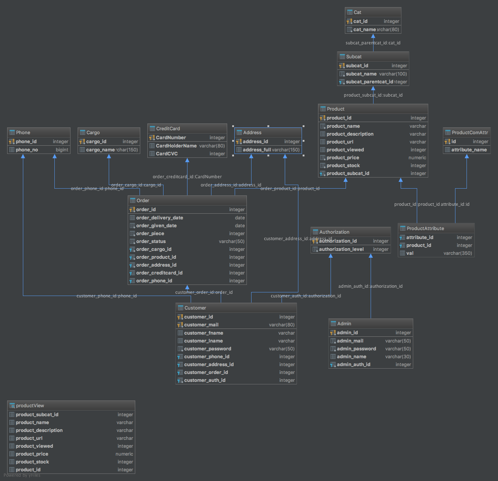
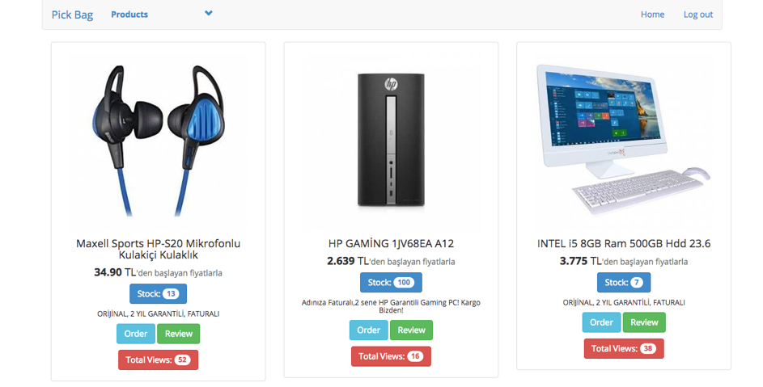
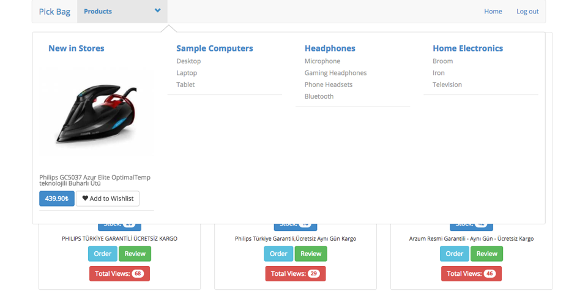
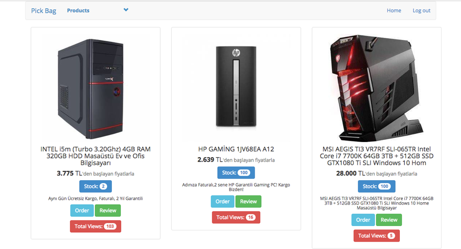
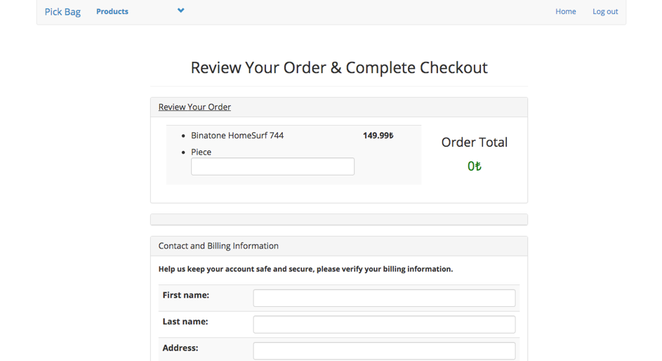
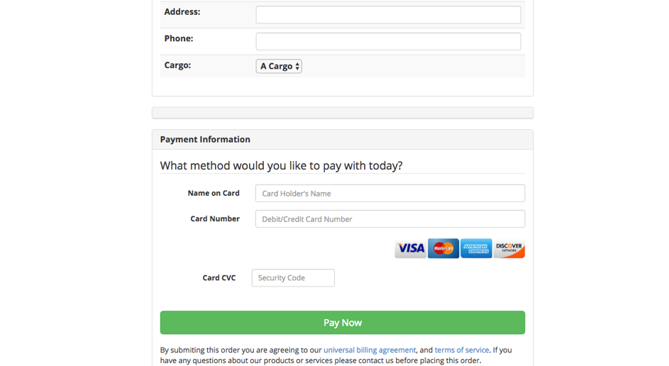
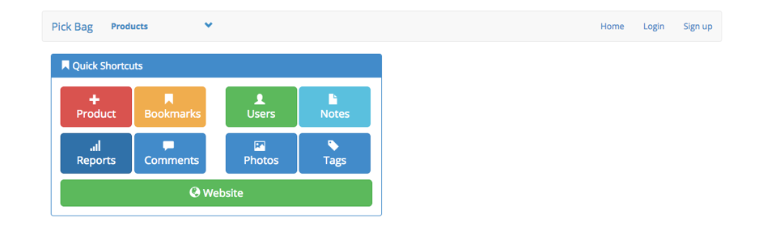
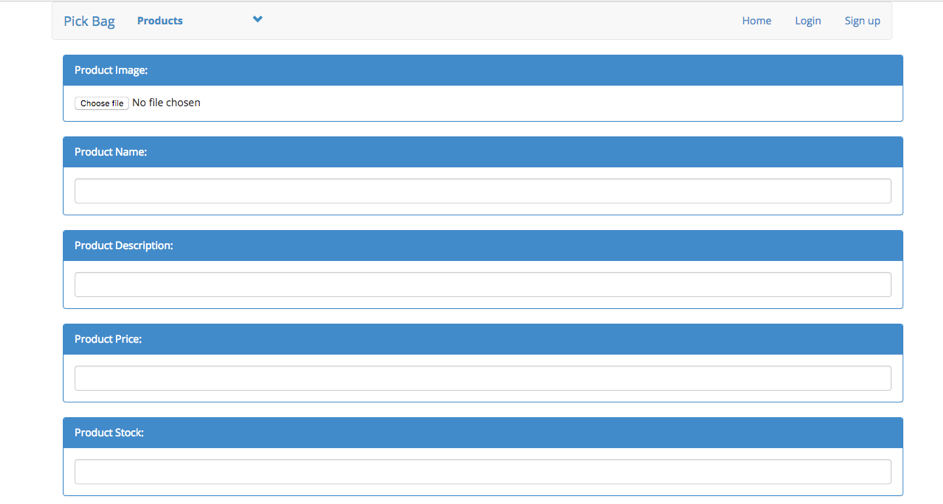
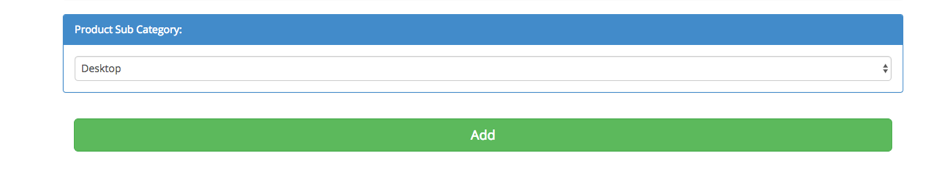

# E-Commerce Django Implementation

DB SCHEMA

Home screen for non-members, the member or non-member can view different products as selected randomly. Non-members can only review the products. In order to give order non-members have to register in my system.

Home screen for members, you should be careful the order button is activated. The user can buy products anymore.

If user want to select different category, it must click products button on the top in my menu as shown.

For example, if user has been clicked desktop. 

If user want to see detail of its selected product, he/she have to click review button.

If user want to buy a product he/she have to click order button.

Admin Screen

To add product screen via admin screen

